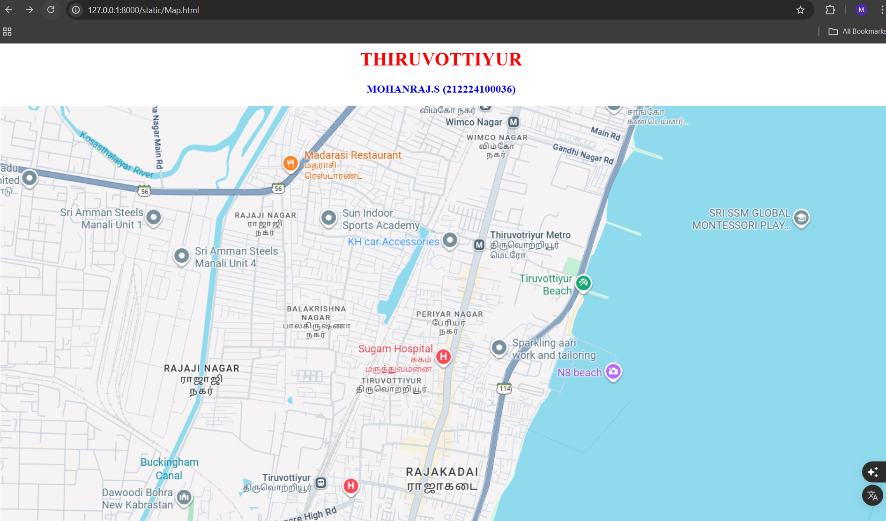
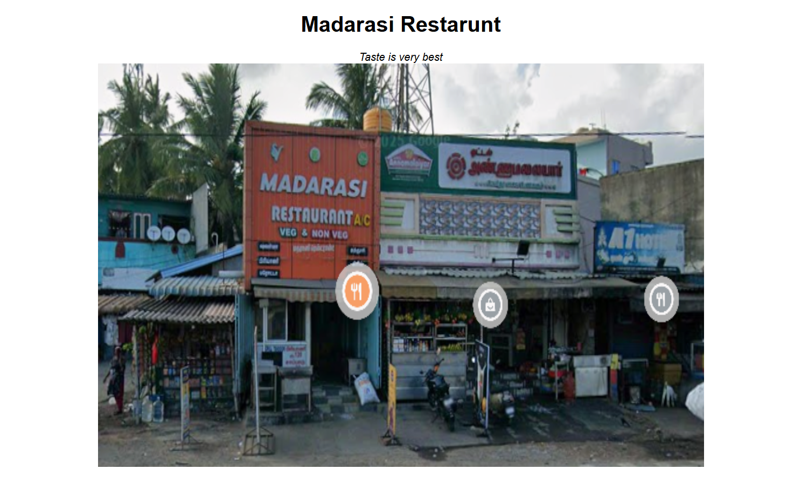
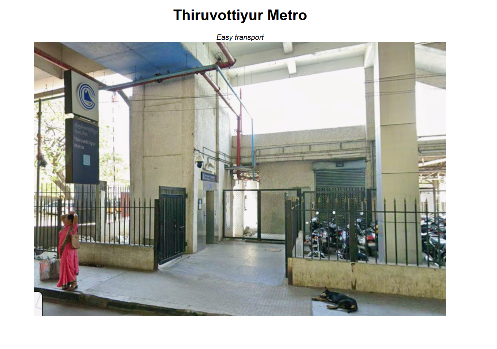
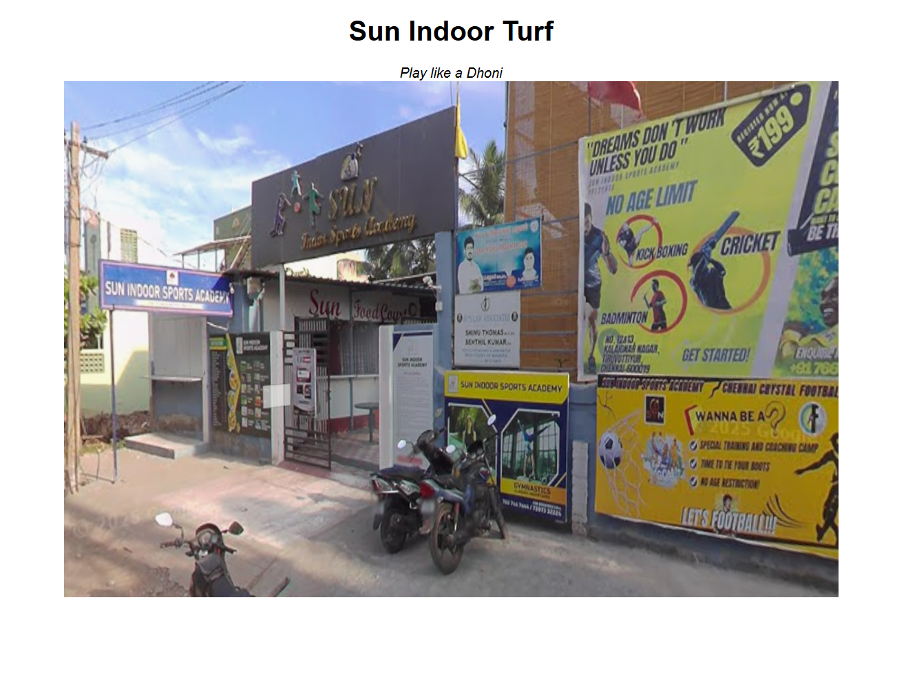
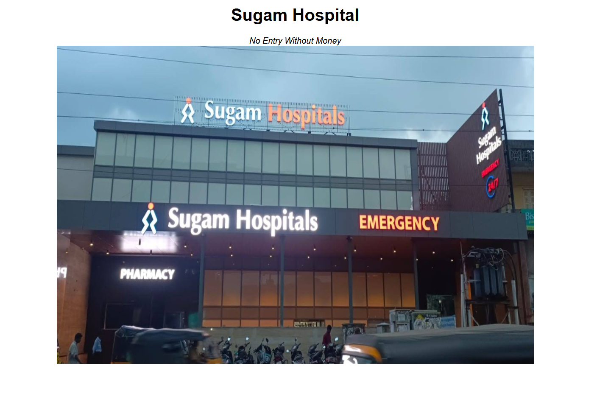

# Ex04 Places Around Me
## Date: 

## AIM
To develop a website to display details about the places around my house.

## DESIGN STEPS

### STEP 1
Create a Django admin interface.

### STEP 2
Download your city map from Google.

### STEP 3
Using ```<map>``` tag name the map.

### STEP 4
Create clickable regions in the image using ```<area>``` tag.

### STEP 5
Write HTML programs for all the regions identified.

### STEP 6
Execute the programs and publish them.

## CODE
## map.html
~~~html
<html>
    <head>
        <title>My City</title>
    </head>
    <body>
        <h1 align="center">
            <font color="red"><b>THIRUVOTTIYUR</b></font>
        </h1>
        <h3 align="center">
            <font color="blue"><b>MOHANRAJ.S (212224100036)</b></font>
        </h3>
        <center>
            <!-- Image Map Generated by http://www.image-map.net/ -->
            
            <map name="image-map">
                <area target="" alt="Turf" title="Turf" href="turf.html" coords="534,167,660,245" shape="rect">
                <area target="" alt="Restarunt" title="Restarunt" href="restarunt.html" coords="461,64,514,56,541,100,508,140,454,119" shape="poly">
                <area target="" alt="Metro" title="Metro" href="metro.html" coords="822,236,61" shape="circle">
                <area target="" alt="Hospital" title="Hospital" href="hospital.html" coords="698,396,815,465" shape="rect">
            </map>
        </center>
    </body>
</html>
~~~
## metro.html
~~~html
<!DOCTYPE html>
<html>
<head>
    <title>Restricted</title>
    <style>
        body {
            background-color: white;
            color: black;
            text-align: center; 
            font-family: Arial, sans-serif;
        }
        img {
            display: block;
            margin-left: auto;
            margin-right: auto;
            height: 600px;
            width: 900px;
        }
    </style>
</head>
<body>
    <h1>Thiruvottiyur Metro</h1>
    <i>Easy transport</i>
    <br>
    
</body>
</html>
~~~
## turf.html
~~~html
<!DOCTYPE html>
<html>
<head>
    <title>Restricted</title>
    <style>
        body {
            background-color: white;
            color: black;
            text-align: center; 
            font-family: Arial, sans-serif;
        }
        img {
            display: block;
            margin-left: auto;
            margin-right: auto;
            height: 600px;
            width: 900px;
        }
    </style>
</head>
<body>
    <h1>Sun Indoor Turf</h1>
    <i>Play like a Dhoni</i>
    <br>
    
</body>
</html>
~~~
## restarunt.html
~~~html
<!DOCTYPE html>
<html>
<head>
    <title>Restricted</title>
    <style>
        body {
            background-color: white;
            color: black;
            text-align: center; 
            font-family: Arial, sans-serif;
        }
        img {
            display: block;
            margin-left: auto;
            margin-right: auto;
            height: 600px;
            width: 900px;
        }
    </style>
</head>
<body>
    <h1>Madarasi Restarunt</h1>
    <i>Taste is very best</i>
    <br>
    
</body>
</html>
~~~
## hospital.html
~~~html
<!DOCTYPE html>
<html>
<head>
    <title>Restricted</title>
    <style>
        body {
            background-color: white;
            color: black;
            text-align: center; 
            font-family: Arial, sans-serif;
        }
        img {
            display: block;
            margin-left: auto;
            margin-right: auto;
            height: 600px;
            width: 900px;
        }
    </style>
</head>
<body>
    <h1>Sugam Hospital</h1>
    <i>No Entry Without Money</i>
    <br>
    
</body>
</html>
~~~

## OUTPUT
# map

# restarunt

# metro

# turf

# hospital


## RESULT
The program for implementing image maps using HTML is executed successfully.
